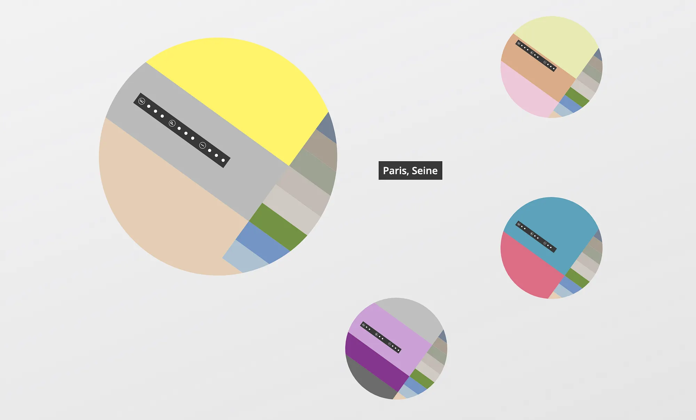
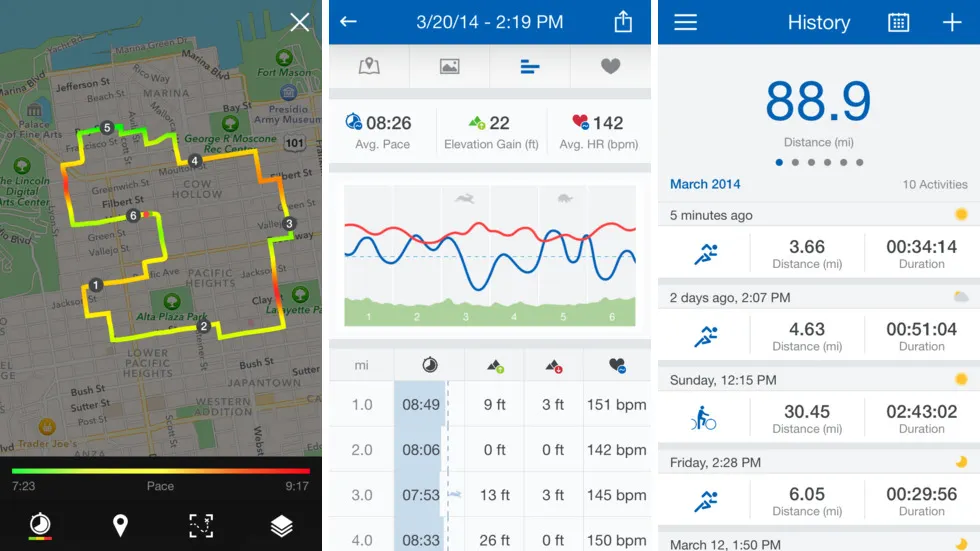
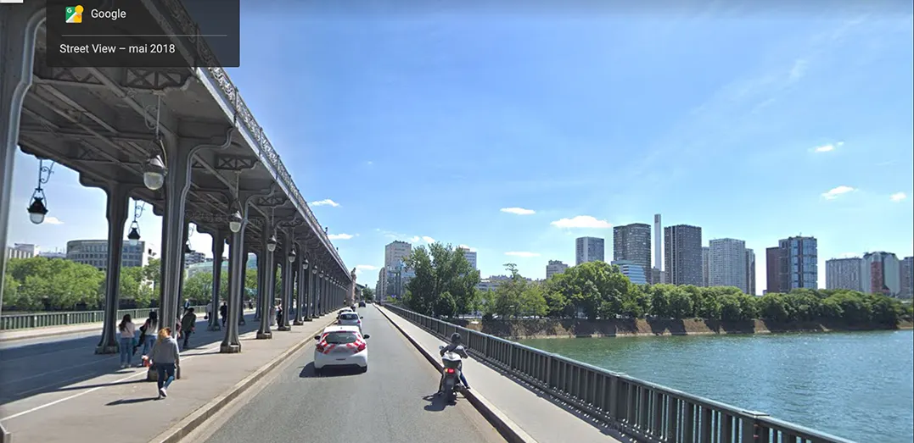
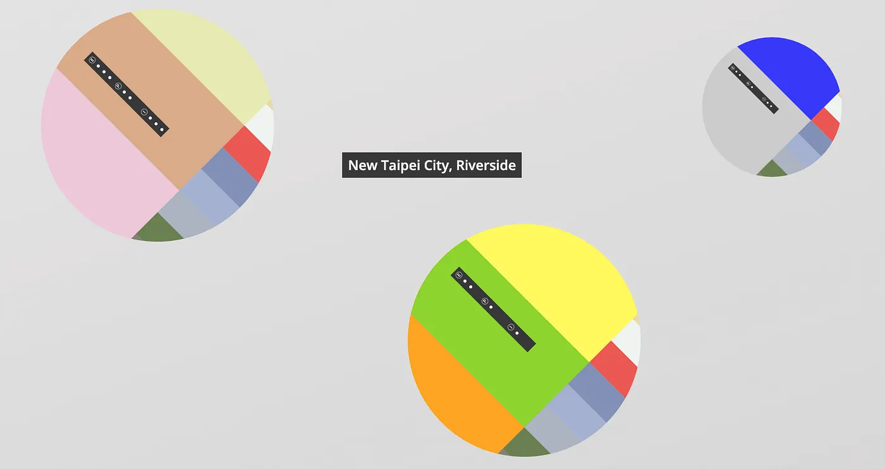

## Data humanism

Data is an imperfect abstraction of the world. We use blindly this interface as reality itself. This is obscurantism and data humanists are here to switch the light on.

The world is made of complicated mechanisms and interactions. Thus, the data capturing the world is also complex. But do we always consider this complexity when working with data ?

In Big Data projects, a piece of data is just one more line. The more lines there are, the more credible the dataset is. The line itself is no more than a drop in the ocean and does not represent anything anymore. It has no specific form, and gives us very little hook on reality. Data is a magic plasma which we feed to data visualization tools which then recommend us the best way of depicting it.

As far as data visualization is concerned, especially dashboards in which each widget answers a specific question and gives a limited amount of information, we hope to explain complex phenomena with generic questions and formatted answers.

Most of the time, data is just what we take from the world to answer our most _valuable_ questions. **We lose the sense of what data represents**. Thus, its complexity in not considered.

Maybe using our digital tools to find answers to generic pre-existing questions is not the only way of behaving with data.

Let’s say I have an app which tracks how many kilometers I ran in the last month. I chose a bar chart to show the distance in km for each week of the month. It is a valid design which gives valid information. It answers the question : “How many kilometers did I run each week ?”. However, it’s only valid and nothing more, because it doesn’t try to mean anything else than what it shows. Maybe one bar in the visualization matches with hours of physical effort in various places with various people feeling various emotions.

Data humanists like [Giorgia Lupi](http://giorgialupi.com/), who wrote [a manifesto](https://medium.com/@giorgialupi/data-humanism-the-revolution-will-be-visualized-31486a30dbfb), say the bar chart is not the issue. The fault is ours, willing to show an inherently human piece of information without considering the human. To find the human in the dataset, they suggest ways to reincorporate empathy at different levels of the data handling.

## Guidelines

Unlike the traditional approach in which questions are asked and answers are found, data should be contextualized. “Sneak context in. (always)” says Giorgia Lupi. The process of analyzing the data while thinking about its possible visual representations will hopefully reveal the substance of the context.

This is why we have to reclaim a personal approach to how data is captured, analyzed and displayed, proving that subjectivity and context play a big role in understanding even big events and social changes — especially when data is about people.

Manually collecting the data makes it more human. Generally, normal data engineers would find an available dataset that suits their needs. But by carefully making it on their own, they would not forget what data represents. Moreover, in trying to have a more humanist approach, there is no need for any specific set of data. In the case of the running app above, the goal is just to translate the experience of the runner into an abstracted visual form, thus no specific form of data is recommended.

[Stefani Posavec](https://www.stefanieposavec.com/) suggests in her talk [at Eyeo 2018](https://vimeo.com/287094544) that the gathering of data can be a worthwhile activity in itself. And she rehabilitates what she calls anoraks providing very personal examples.

Then, the data analysis process can be partly done by diving into the dataset. Doing data visualization hand sketching at the same time may reveal the set’s underlying structures. With this way of mixed analysis and design, the usual data driven designs paradigm might be dodged.

Even after the data visualization design is done, the data analysis process is not over yet. The design’s purpose is to depict complex phenomena, therefore part of the analysis work should be left to the reader of the design. This is what people at [Accurat](https://www.accurat.it/) call non-linear storytelling. The users are invited to pick their information and to make a story out of it.

## A more human running app

I like running a lot. And when I discover a city, I try to find nice running tracks, both to exercise and to discover the places I visit. I sometimes use a running app that tracks my runs and sums it up into data visualization designs. Of course the running apps are mainly made for athletes who want to have reports about their performances, therefore the designs are non-humanistic. As I am not an athlete, and now that the data humanism rules are a little clearer to me, I have tried to design my own running reports.

The reports in the original running app gives three types of visualization design. First a bar chart giving the km ran in the last weeks, like mentioned above. Then a map, where the circuit is highlighted, with gradients from green to red depending of the speed. And finally line charts giving many other insights on the last run.

I am sensitive to colors as general impressions. When I think about the tracks I’m used to running through, I imagine a series of colors. In Paris, I imagine the beige of the buildings with the grey of the Seine and the intense blue sky.

For the data collection, I decided to go through my usual tracks on google street view, and to choose at each kilometers the color that strikes me the most.

Now my data is made of a series of circuits, and for each of them a series of colors.

Just like most people on earth, I rarely run without listening to music. And I also see the albums I listen to as shades. Therefore, for each one of my last 9 runs, I wrote down the music I listened to and gave it colors.

For each of these runs, I also gave three types of feedback. An environmental feedback, from 1/3 for a poor running environment at that time, to 3/3 for a great experience. A physical fulfillment feedback, 1/3 for physical hard times, and 3/3 for perfect conditions. End eventually a psychological feedback, often linked to the music I listened to.

I also added to my personal data various indicators like the length of the tracks or its difficulty.

Then, I had to find interesting ways to squeeze the data and to shape the design so that I could achieve a visualization that translates my running experience. I wanted to give a colorful feel for each of the runs.

The fact that I decided to make a (slightly) interactive website with the library d3.js is not insignificant. One of the themes of data humanism is that technology and data should drive as few decisions as possible. And displaying the unfixed result through a digital interactive medium (with a library meaning literally ‘data driven’) means that technology has given structure to the design.

However, in that case study, I used the JavaScript technology to enhance the storytelling by adding interactivity. A click on any color element related to a specific music opens a new tab with a YouTube video playing that music.

A click of the mouse, a tap with the thumb or the mouse going over an element are all dimensions added to the space of the stories that can be told through the design. And as a first attempt to data humanism design I hope that at least some running stories will be read through my experiment.
