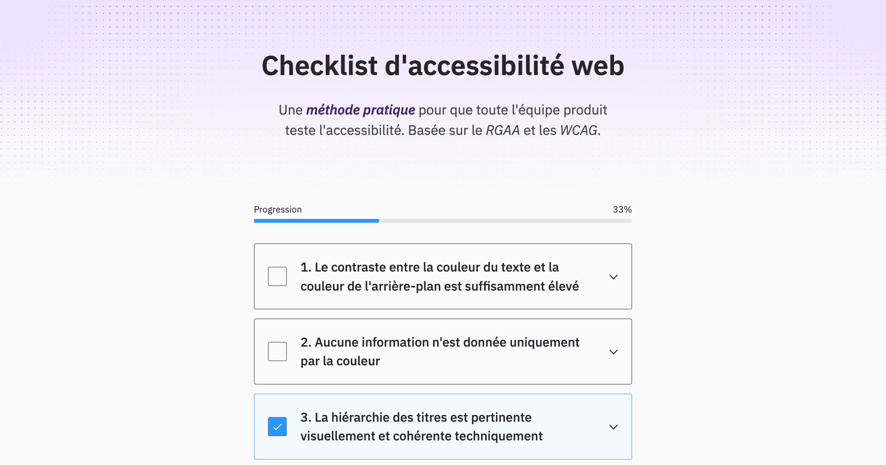
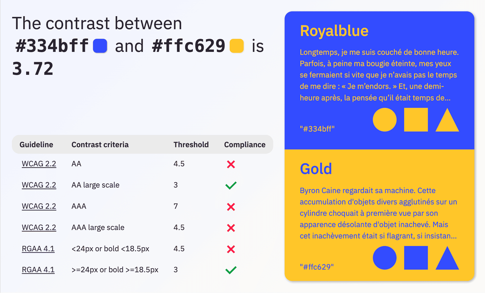
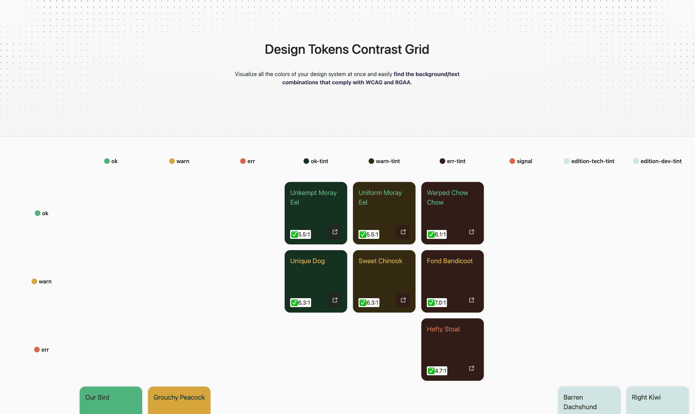
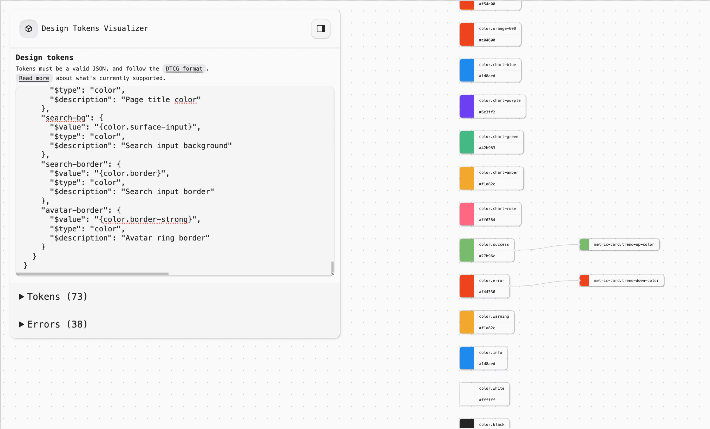

This year I published a set of tools aimed at helping product teams and design system teams building more inclusive products.

## Accessibility Checklist

[a11ychecklist.guillaumemeigniez.me (in French)](https://a11ychecklist.guillaumemeigniez.me/)

When I worked for [pass Culture](https://pass.culture.fr/), the feature teams were (mostly) responsible for testing the accessibility of their releases. To compensate for the lack of team members with manual accessibility testing knowledge, I built a checklist so that anyone with minimal web literacy could identify most of the recurrent accessibility issues.

What differentiates this checklist from the ones available on the web (of variable quality) is that it was specifically made for its audience. Most checklists on the web are WCAG focused, and are of two types: whether they go through all the criteria and for each one of them re-phrasing the content of the "How to meet" section, or they just give a some very basic advice.

People at pass Culture knew these resources existed and still did not use them. [What I think matters](https://guillaumemeigniez.me/blog/8StepsToBetterAccessibility/) is that people have access to accessibility documentation they can understand.

I identified the most common a11y compliance errors from previous audits. The manual testing of releases in teams without any accessibility specialists is bound to fail if they need to re-check the whole list of criteria for every delivery cycle. The team's effort should at least eliminate 80% of nonconformities (that are not yet caught by automated tools) without spending a whole day on it.

I put emphasis on the reason the rule exists. Most of the time, people have no idea why the website's title hierarchy must be coherent, or why links must be explicit about their way of opening. Explaining the reasons for a rule makes the testers care more for the inclusivity of the UI.

Since we were working for a French government entity, we were required to comply with RGAA (a derivative from the European standard EN 301 549 that is itself basically WCAG 2.1). The RGAA often has a slightly different take on a11y testing, compared with what W3C guidelines say. Which makes the existence of the RGAA-focused checklist even more relevant.

The checklist is in French. It does not make sense to translate it into English since no-one in the anglophone world refers to RGAA.

## Color Contrast Checker

[a11ycontrast.eu](https://a11ycontrast.eu/)

I'm always frustrated when I need to know the contrast level of a pair of colors. I have to open a tool or a website to manually type both colors and to decipher the UI to find which criteria applies.

I wanted a website that I can query to get that contrast ratio. And I needed to see the result of text over background combinations both ways. Most of all, I wanted to just have to type the colors code into the URL and nothing more.

Now when I type `https://a11ycontrast.eu/#1e2876/#29dbff` in the URL I immediately know that Midnight Blue and Deep Sky Blue have a sufficient contrast level over all criteria!

What always makes contrast compliance tools a little confusing is that there are different contrast thresholds for AA and AAA, but also that it depends on whether or not the text is "large scale".

[What is "large scale"](https://www.w3.org/WAI/WCAG22/Understanding/contrast-minimum.html#dfn-large-scale)?

> with at least 18 point or 14 point bold or font size that would yield equivalent size for Chinese, Japanese and Korean (CJK) fonts

A "point" being 1/72 of an inch, because not everyone has a screen with the same [pixel density](https://en.wikipedia.org/wiki/Pixel_density). The standard on the web is to consider that the screen is 96 pixels per inch (PPI) but this is an approximation.

I also added the RGAA criteria (which are equivalent to WCAG AA) because the rule is phrased in px and not in points, but it does not make a significant difference.

## Contrast Checker Grid for Design System Tokens

[a11ycontrastgrid.guillaumemeigniez.me](https://a11ycontrastgrid.guillaumemeigniez.me/)

There is one thing we were always unsure of when building the tokens system at pass Culture. Among all color tokens, which combinations of text/background had a high enough contrast? Since the combinations change every time a single color is updated, it was a pain to always make sure that the combinations used in the apps were compliant.

Most importantly, we needed a way for every designer to understand which color combinations can be used. One can assume that it's completely fine to have `text-color-default` over `background-color-default`, but what about `text-color-success` over `background-color-subtle` ?

I built this website to have a visual way to identify immediately all the color combinations that can be used given an accessibility conformance level. I added jpeg export so that the results can be easily shared as well.

One thing that seemed important was to have multiple ways of importing tokens. CSS variables seem like the default import to me, but I also included [DTCG](https://www.w3.org/community/design-tokens/) tokens JSON import. The format seems to be gaining traction even though it is not a widely adopted standard (it is often only partially supported).

## Design Tokens Visualizer

[tokens-visualizer.guillaumemeigniez.me](https://tokens-visualizer.guillaumemeigniez.me/)

Initially built as an experiment for parsing DTCG tokens, I eventually published this website to visualize design tokens.

In a design system, design tokens reference each other. "Primitive" tokens bear an absolute value such as "#FF00FF" or "12rem", "semantic" tokens reference those primitive tokens, and you can have a layer of "component" tokens that references the semantic layer.

When looking at a design tokens file it's hard to understand the relationships between layers. Usually you'll have one section for the primitives, then one section per theme for the semantic, and then the component tokens might be in a section per component. And all that in different files.

To make sense of a design system, it's important to see the flow of tokens relationships.
