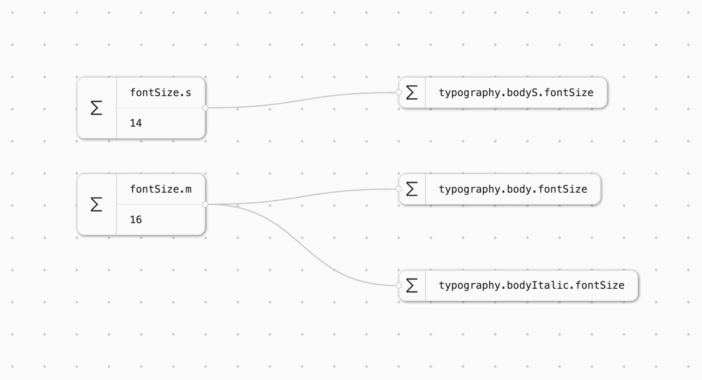
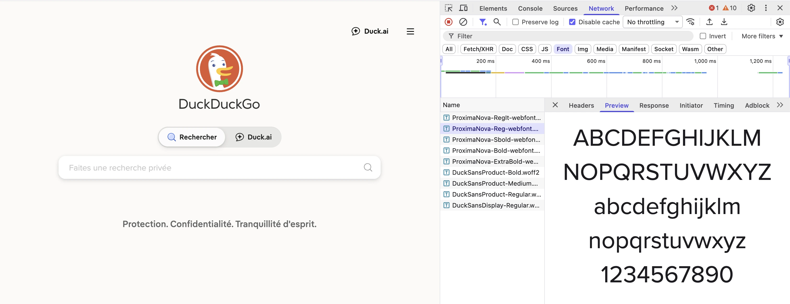

Let's say you are a designer or a developer maintaining a design system for the web.
The system is ideally integrated end-to-end between your design tool (e.g. Figma variables) and the code (e.g. CSS variables). Updating the variable value in Figma automatically changes its value in the code, and the modification propagates to the end user.

Have you ever tried updating your typography tokens? Chances are that for some of them you can't change their values that easily, and you might not realise it until it breaks your design system users' websites.



The goal of this series of blog posts is to show why it may be the case and what solutions exist to make it right.

Unlike colour tokens (that are quite straightforward to set up) typography tokens might not behave as you think if you are not aware of how fonts work on the web.

But let's start from the beginning, what do typography tokens usually look like?

## Typography tokens

If you are using Figma, you have "typography styles" each having a few typography parameters mapped to Figma variables. You probably have something resembling the following typography variables setup: `fontFamily`, `fontWeight`, `fontSize`, `lineHeight`, `fontStyle` and maybe `letterSpacing`.

In the code, it looks the same. If you open Dev Mode on Figma, or if you look at the apps CSS you'll see that the CSS styles match your token names. Here is an example of how these tokens would be used in CSS:

```css
.text {
  font-family: var(--body-italic-font-family);
  font-weight: var(--body-italic-font-weight);
  font-style: var(--body-italic-font-style);
}
```

Easy, it makes sense, one CSS property = one token = one typography style parameter.

If you tried updating the value of the font weight of one of your typography styles (let's say `bodyItalic.fontWeight`) in Figma, it would update and be applied instantly in the Figma workspace. However when the change propagates to the code, it would most certainly not have the expected result. And it boils down to the way fonts work on the web.

## Web fonts

When you open a web page, your browser has to download a font file associated with the text that you want to display on screen. You can see that by opening your browser inspector's "Network" tab and by filtering on "Font":



In the example above there are multiple files downloaded just for the Proxima Nova font: "Reg" (Regular), "RegIt" (Regular Italic), "SBold", "Bold", "ExtraBold".

This happens because each font file only contains one specific combination of font family, weight and font style, i.e. `ProximaNova-RegIt-webfont.woff2` is the one file that contains all the glyphs of the Proxima Nova font family, with the regular weight and the italic style. If for example one piece of text is not italic, the browser needs to download a whole new file for that font family, that weight and the font-style.

So the browser knows thanks to CSS that it needs "Proxima Nova", in weight 400 and in style italic, but how does it link that requirement to the `ProximaNova-RegIt-webfont.woff2`?

Well this is the piece that many design system teams miss. This matching between font files and CSS typography styles is done through a CSS [font-face @-rule](https://developer.mozilla.org/en-US/docs/Web/CSS/Reference/At-rules/@font-face). If you look in the css files loaded by your browser when you open a web page, you'll also find somewhere something like:

```css
@font-face {
  font-family: Proxima Nova;
  src: url(/static-assets/font/ProximaNova-RegIt-webfont.woff2) format("woff2");
  font-weight: 400;
  font-style: italic;
}
```

This is a `@font-face`. Whenever the browser finds a text that must be displayed using "Proxima Nova", with a weight of 400 and a style of italic, it looks at the font-face rule in CSS, and deduces that the character glyphs to use are to be found at `/static-assets/font/ProximaNova-RegIt-webfont.woff2`. Then the font file is downloaded and used to display the characters.

The catch is that the `@font-face` is most of the time hard-coded by developers, and only contains the already existing combination of family, weight and style.

When you update your `bodyItalic.fontWeight` token from `400` to `500`, the browser sees a text node with the following styles:

```css
.text {
	font-family: var(--body-italic-font-family); // "Proxima Nova"
	font-weight: var(--body-italic-font-weight); // Previously 400 now 500
	font-style: var(--body-italic-font-style); // "italic"
}
```

It looks up the `@font-face` for that combination. That matching rule does not exist because font-face setup is not dynamically reacting to the typography tokens. The browser tries to display something that looks like what you wanted but you don't get the expected result. What you eventually get displayed is hard to predict, and might break readability in some contexts. The browser could choose to swap your font for a fallback, or to change the weight of your snippet to match one of the existing combinations in the font-face, or even to perform a [font synthesis](https://developer.mozilla.org/en-US/docs/Web/CSS/Reference/Properties/font-synthesis).

On a side note, updating the font size, the line height or the letter spacing should not be a problem since these parameters are not dependent on the font file being loaded.

In the end, the token pipeline breaks silently. Everything looked fine on Figma, the modification seemed benign, and it only broke at the last step when you, the designer, see the typography issue on the website.

The perfect solution to this problem does not seem to exist yet. It's not that easy to make the `@font-face` dynamically react to the token change because you would need to dynamically specify a location for a font file (among other things).

Some popular design systems have come up with (mostly partial) solutions to this. Following or not their example will depend on the specifications of your own design systems.

In Part 2 I'll compare the pros and cons of 3 design system approaches.
